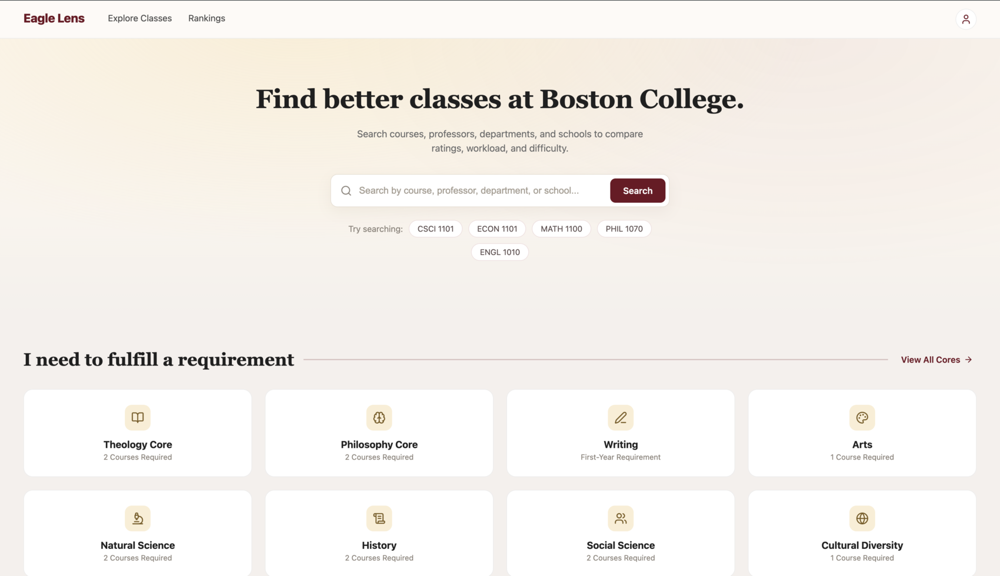
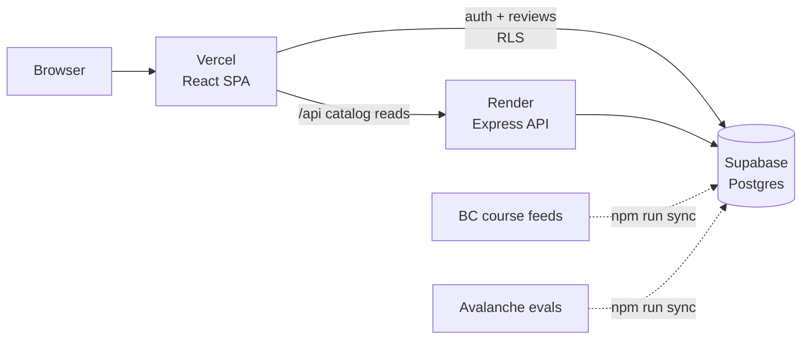
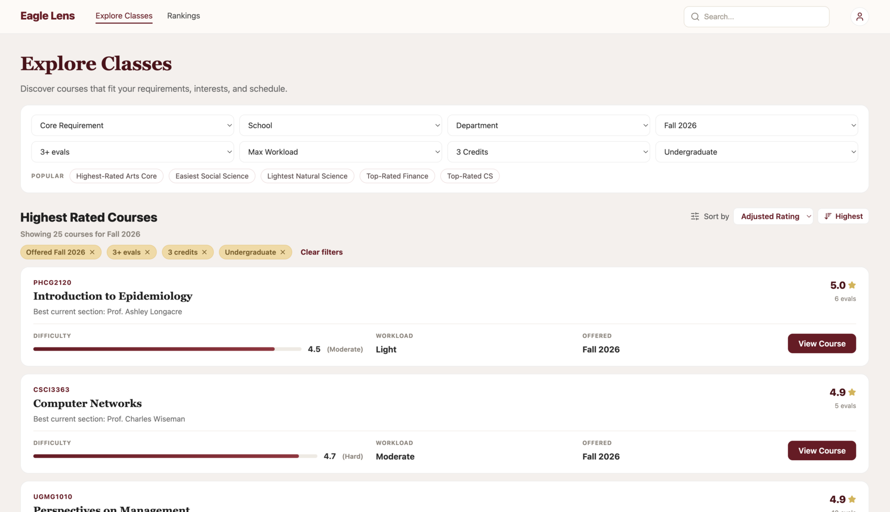
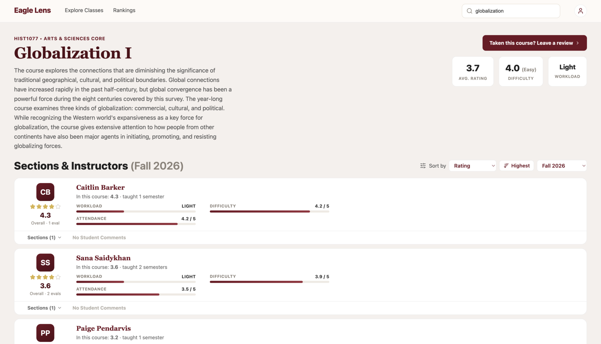
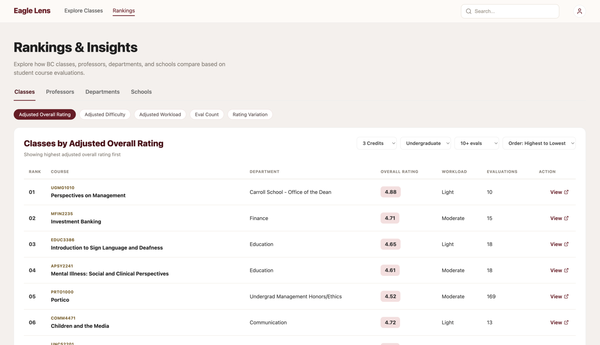

# Eagle Lens

A course discovery and professor evaluation platform for Boston College students.

🌐 https://eaglelens.org



## About

Eagle Lens helps Boston College students explore courses and professors using
course information, historical offerings, and student evaluation data.

Since launching in June 2026, Eagle Lens has reached 2,400+ unique visitors,
including 1,000+ during the start-of-semester add/drop period.

## Features

- Search thousands of courses and professors
- Filter courses by core requirement, school, department, credits, and workload
- Compare professor and course ratings, difficulty, and workload
- Browse historical course offerings with a per-semester view
- Rank classes, professors, departments, and schools by adjusted rating,
  difficulty, workload, eval count, or rating variation
- Leave course reviews and recommendations
- Google sign-in, restricted to `@bc.edu` accounts

## Tech Stack

- **Frontend:** React 18, TypeScript, Vite, React Router 7
- **Backend:** Node.js, Express 4, tsx
- **Database:** PostgreSQL via Supabase (SQL views + RPC functions)
- **Authentication:** Supabase Auth — Google OAuth, `@bc.edu` only
- **Analytics:** PostHog, Vercel Analytics
- **Data pipeline:** Cheerio + graphql-request scrapers
- **Deployment:** Vercel (frontend), Render (backend)

## Architecture



Catalog data — courses, sections, instructors, ratings — is read through the Express
API, which queries Supabase with the anon key and shapes the results. User data —
sign-in, reviews — goes from the browser straight to Supabase, where Row Level
Security is the boundary rather than the API.

The database itself is the union of two feeds, stitched on course code plus a
canonicalized instructor name: BC's public course catalog (authoritative for course
and section metadata) and Avalanche, BC's internal evaluations system. Both are
pulled in by the sync scripts, never at request time.

## Screenshots

<table>
  <tr>
    <td width="50%">
      
      <br><em>Explore — filter by core, school, department, and workload</em>
    </td>
    <td width="50%">
      
      <br><em>Course — per-professor ratings, difficulty, and workload</em>
    </td>
  </tr>
  <tr>
    <td width="50%">
      
      <br><em>Rankings — classes, professors, departments, and schools</em>
    </td>
    <td width="50%"></td>
  </tr>
</table>

## Running Locally

### Prerequisites

- **Node.js 20+** and npm
- A Supabase project

### 1. Install

The repo is an npm workspaces monorepo, so a single install at the root covers
both `frontend/` and `backend/`:

```bash
git clone https://github.com/tomasliivak/PlanYourBC.git
cd PlanYourBC
npm install
```

### 2. Configure environment

```bash
cp backend/.env.example backend/.env
cp frontend/.env.example frontend/.env
```

**`backend/.env`**

| Variable | Required | Notes |
| --- | --- | --- |
| `SUPABASE_URL` | Yes | Supabase project URL. The API throws at startup without it. |
| `SUPABASE_ANON_KEY` | Yes | Key the API uses for reads — RLS is public-read, so this is all it needs. Falls back to the service-role key if unset. |
| `SUPABASE_SERVICE_ROLE_KEY` | Sync only | Bypasses RLS. Needed by the `sync` scripts. Never deploy or commit it. |
| `PORT` | No | Defaults to `3000`. |
| `ALLOWED_ORIGINS` | No | Leave empty locally — an unset value allows all origins. |

**`frontend/.env`**

| Variable | Required | Notes |
| --- | --- | --- |
| `VITE_SUPABASE_URL` | Yes | Browser Supabase client, used for auth and reviews. |
| `VITE_SUPABASE_ANON_KEY` | Yes | Safe to expose — RLS is the security boundary. |
| `VITE_POSTHOG_KEY` | Yes (dev) | See the note below. |
| `VITE_POSTHOG_HOST` | Yes (dev) | See the note below. |
| `VITE_API_BASE_URL` | No | **Leave unset locally** so `/api` calls go through the Vite dev proxy to port 3000. |

> [!IMPORTANT]
> `VITE_POSTHOG_KEY` and `VITE_POSTHOG_HOST` are **required in development**.
> `frontend/src/lib/posthog.ts` deliberately throws at import time when either is
> missing — so `npm run dev` renders a **blank page** until both are set. Production
> builds skip PostHog silently instead.

### 3. Database

If you're pointing at the existing, already-populated Supabase project, there is
**nothing to seed** — skip to step 4.

For a fresh project, apply `supabase/migrations/0001…0030` in order via the Supabase
SQL editor. This repo has no `supabase/config.toml` and does not depend on the
Supabase CLI, so `supabase db push` is not wired up. Then populate the tables with
`npm run sync -w backend` (see [Data freshness](#data-freshness)).

### 4. Run

```bash
npm run dev
```

Frontend on http://localhost:5173, backend on http://localhost:3000. Verify the API
with `curl localhost:3000/api/health`.

## Development

Run both apps together:

```bash
npm run dev
```

Or run them individually:

```bash
npm run dev:frontend   # Vite dev server (http://localhost:5173)
npm run dev:backend    # Express server (http://localhost:3000)
```

There is currently no test suite or linter configured.

## Build

```bash
npm run build
```

This builds the frontend, then the backend. The frontend build wraps `vite build`
with two extra steps:

- **`prebuild`** — `scripts/generate-sitemap.mjs` writes `public/sitemap.xml` from the
  ranking RPCs.
- **`postbuild`** — `scripts/prerender.mjs` writes static `dist/<route>/index.html`
  shells for every course and professor page, with route-specific titles, meta
  descriptions, and Open Graph tags for crawlers.

Both read Supabase directly and degrade gracefully: without credentials they warn,
exit 0, and leave a valid SPA build with a static-only sitemap. Note they read plain
`SUPABASE_URL` / `SUPABASE_ANON_KEY` — **not** the `VITE_`-prefixed ones — so a normal
local build skips prerendering unless you set those too.

## Deployment

The frontend (Vercel) and backend (Render) deploy as two separate services on
different origins. The frontend reaches the API via `VITE_API_BASE_URL`, and the
backend restricts CORS to the frontend origin via `ALLOWED_ORIGINS`.

Deploy in this order so each side knows the other's URL:

### 1. Backend → Render

- **Root Directory:** `backend`
- **Build Command:** `npm install && npm run build`
- **Start Command:** `npm run start` (runs `node dist/index.js`)
- **Environment variables:**
  - `SUPABASE_URL` — your Supabase project URL
  - `SUPABASE_ANON_KEY` — the anon key (RLS is public-read, so this is all the API needs)
  - `ALLOWED_ORIGINS` — your Vercel domain, e.g. `https://your-app.vercel.app`
    (any `*.vercel.app` preview origin is also allowed automatically, and
    `eaglelens.org` / `www.eaglelens.org` are always allowed regardless of this value)
  - `PORT` is injected by Render automatically.
- Do **not** set `SUPABASE_SERVICE_ROLE_KEY` here — it's only for the local sync (below).

Note the in-memory rate limiter (`backend/src/middleware/rateLimit.ts`) is per-instance;
it's fine for a single Render service but won't share counts if you scale to multiple instances.

### 2. Frontend → Vercel

- **Root Directory:** `frontend`
- **Framework Preset:** Vite
- **Build Command:** `npm run build` · **Output Directory:** `dist`
- **Environment variables:** `VITE_API_BASE_URL` — the Render backend origin, no trailing
  slash, e.g. `https://your-backend.onrender.com` — plus `VITE_SUPABASE_URL`,
  `VITE_SUPABASE_ANON_KEY`, `VITE_POSTHOG_KEY`, and `VITE_POSTHOG_HOST`.
- `vercel.json` provides the SPA fallback so deep links (`/explore`, `/courses/CSCI1101`)
  don't 404.

After the frontend deploys, make sure `ALLOWED_ORIGINS` on Render matches its final domain.

### Data freshness

The database is populated by the sync scripts in `backend/scripts/`, which pull BC's
course feeds and Avalanche evaluations. They require `SUPABASE_URL` and
`SUPABASE_SERVICE_ROLE_KEY` in `backend/.env` and are run **manually/locally** — the
service-role key bypasses RLS and must never be deployed or committed. Production data
stays as-is until you re-run sync.

```bash
npm run sync -w backend          # classes, then evals
npm run sync:classes -w backend  # BC course feeds only — a few minutes
npm run sync:evals -w backend    # Avalanche evals — tens of minutes
npm run sync:rmp -w backend      # optional RateMyProfessors review import
```

`sync:evals` reads course codes from the database, so it must run *after*
`sync:classes` — which is the order `npm run sync` uses. A few environment variables
cap the slow scripts while testing:

| Variable | Applies to | Effect |
| --- | --- | --- |
| `SYNC_LIMIT` | `sync:evals` | Only query the first N course codes |
| `RMP_LIMIT` | `sync:rmp` | Only process the first N instructors |
| `RMP_DELAY_MS` | `sync:rmp` | Delay between requests (default `1000`) |

```bash
SYNC_LIMIT=20 npm run sync:evals -w backend
```

